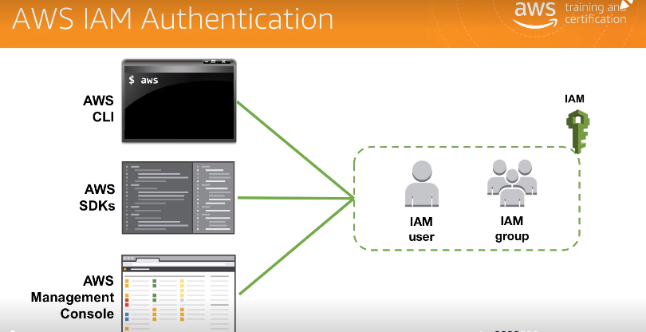
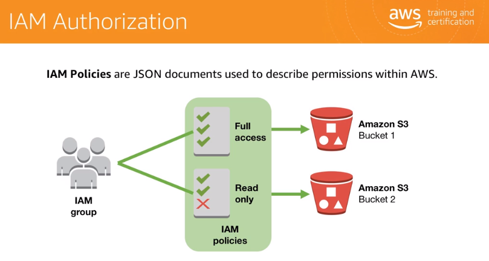
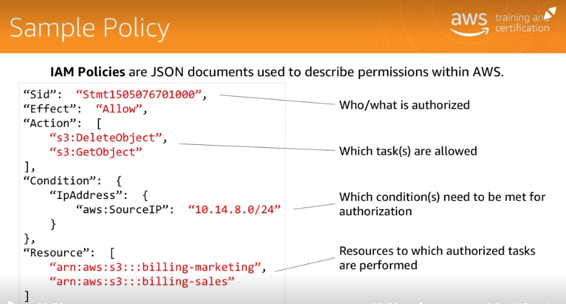
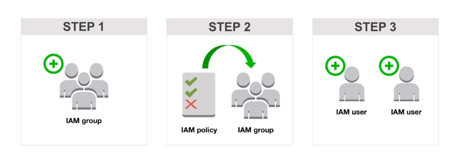
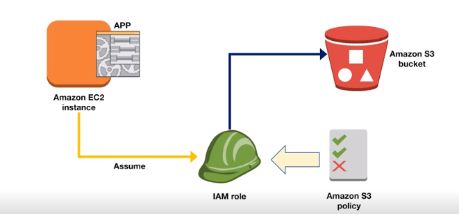
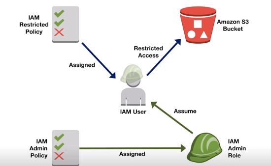

[TOC]

# IAM (Identity access Management)

Its an identity management system helps to manage access to resorces in AWS
First account you created with AWS is called root account and has full access to all resouces, 
But in organisation level we dont want to grant full access to every user. To solve this problem we have IAM
IAM basically perform 2 things 
 * Authuntication : validating user
 * Authorization : Providing respective access

## How to connect to AWS?
 - AWS CLI
 - AWS SDK/ API
 - AWS Management Console
 

 If any user has to communicate with AWS he has to cross IAM.
 Here IAM can act as filter to contoll access.

## We have to understand few terminologies

### User:
    - if we are small group we have assign access to individual user

### Group:
    In organistion its difficult to customize for every user, so we will create group and add users in to groups
    ex: Admin group, developer ,...
    

### Policies:
    - Policies are nothing but rules/ permissions to  access resources
    - Its a JSON Document which is assigned explicitly
     

### Steps to be fllowed to get things Done
    - Create Group
    - Assign Policies to Group
    - Add Uses to group 

    

### Now IAM Roles :
 Its little tricky concept to understand let undrstand with examples
    - Suppose a app want to connect to AWS s3 
        - Its would connect via API call and it should have access credintials to connect to s3 it will conpromise security so e have a role with has access to s3 
        app >role > s3
        
    - Role can we used by users also some times
    

### Federation policy /Identity federation
 This will allow organisations to use there own email/ passwords to access AWS.
 this is how we authenticate other apps with gmail/facebook.

## Key Features
* Multi factor Authentication: It adds next level authentication
* Temporary Access:
* Password Policy : we can controll lifetime of password
* Integration: It can we connected in many AWS services
* Compliance: supports PCI DSS complines (ayment card Industry)

