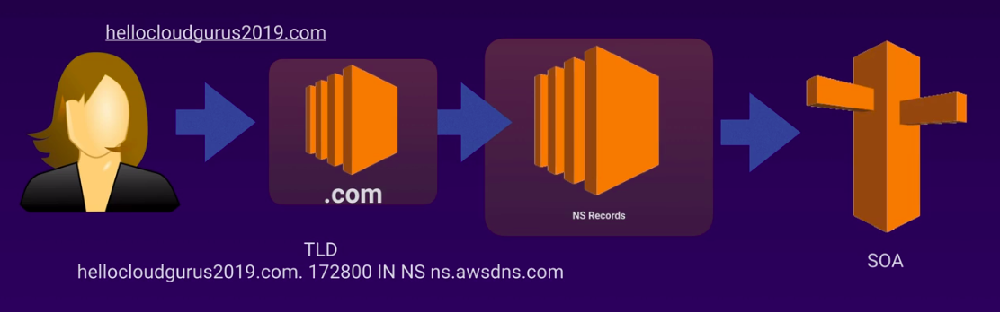

[TOC]
# Route 53
DNS(Docmain name Service) is on Port 53, where name route53 comes

Just remember Ph book(search nuber of a person based on name) to understand DNS Better

DNS Convert domain name to IP, 
Again ips are basicall 2 types
    - IPv4(32bit addresses) and IPv6(128bit addresses)

Domain Registrars:
 who sells/maintains domains 

## Common DNS Types
* SOA Records 
    name stores information like who supplierd data for the source,adminstrator,current version, time to live(TTL)  
* NS Records
    they use top level Domain Servers to direct traffic 

* A Records
    It actually holds the ip address for the DNS name
* C Names
    canonocal name its like mapping one name to another name m.google.com can we cnamed to moobile.google.com
* Alias Records
    key fidderence between cname and alias is it cant be used against naked domain names 
* MX Reords
    used for mail
* PTR Records
    reverdse of a Record looking for name from ip address

    

